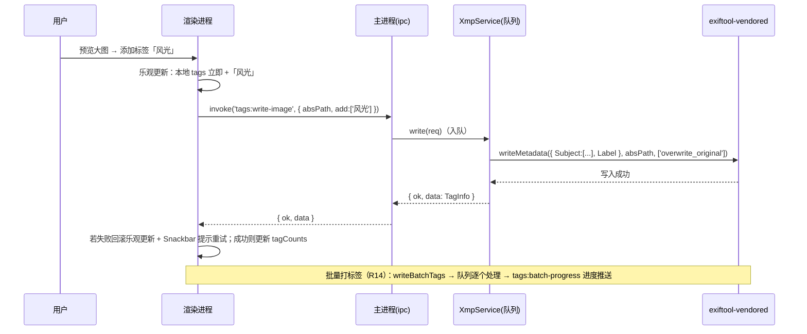
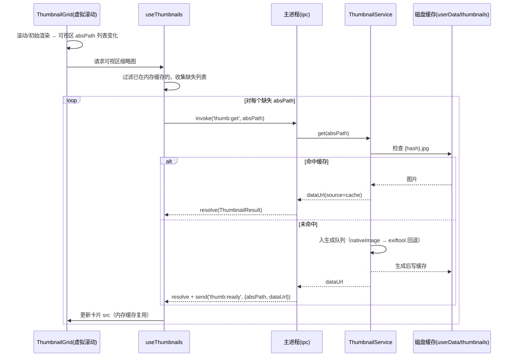

# PhotoTagManager 系统架构设计（ARCHITECTURE）

> 版本：v0.1（初稿） · 作者：架构师 高见远（Gao） · 状态：待评审
> 依据：`docs/PRD.md`（v0.1）
> 面向对象：工程师（照此实现）、QA（照此验证）
> 团队任务对应：本文 T01–T05 为实施批次（对应团队任务 #3 工程师批量实现）；QA 验证对应团队任务 #4

---

## 1. 技术架构总览

### 1.1 架构一句话

Electron 三进程架构：**主进程**持有全部文件系统/XMP/缩略图能力并做 IPC 路由，**Worker 线程**负责后台目录扫描（批推送），**渲染进程**只做 React UI 与内存状态管理（zustand），三者通过预定义 IPC 通道协作，保证万级图片不卡顿。

### 1.2 进程职责划分

| 进程/线程 | 职责 | 关键技术点 |
|---|---|---|
| **主进程**（`electron/`，Node 环境） | 创建窗口；注册所有 IPC Handler；编排扫描（启动/取消 Worker）；持有 exiftool 队列（XMP 读写）；缩略图生成队列 + 磁盘缓存；hiddenFolders.json 持久化 | `contextIsolation: true, nodeIntegration: false`；所有磁盘操作只在主进程 |
| **Worker 线程**（`scanWorker.ts`，worker_threads） | 递归遍历目录；识别图片扩展名；统计每目录 `directCount` / `totalCount`；每 ~200 文件推送一批结果；响应取消 | 只读文件系统，不触碰 XMP（性能） |
| **渲染进程**（`src/`，React） | 三栏 UI；目录树渲染与懒加载；虚拟滚动缩略图网格；预览覆盖层；标签筛选；调用 `window.api`；内存状态管理 | 无 Node 权限，仅通过 preload 暴露的 `window.api` 通信 |

### 1.3 进程间通信（IPC）设计

- **请求-响应**：`ipcRenderer.invoke` / `ipcMain.handle`，通道命名规范 `域:动作`（小写 kebab-case）。
- **主→渲染推送**：`webContents.send('域:事件', payload)`，渲染进程经 preload 订阅。
- **统一响应信封**：主进程 Handler 一律返回 `{ ok: true, data }` 或 `{ ok: false, error: { code, message } }`，禁止裸抛异常。

| 通道 | 方向 | 说明 |
|---|---|---|
| `dialog:pick-directory` | 渲染→主 | 系统目录选择器，返回绝对路径 |
| `scan:start` | 渲染→主 | 入参 rootPath，启动扫描 |
| `scan:cancel` | 渲染→主 | 终止当前扫描 |
| `scan:progress` | 主→渲染 | 推送扫描增量批（每 ~200 文件） |
| `scan:done` | 主→渲染 | 扫描完成（含最终统计） |
| `scan:error` | 主→渲染 | 扫描失败 |
| `folder:hide` / `folder:unhide` | 渲染→主 | 隐藏/取消隐藏（相对路径） |
| `folder:list-hidden` | 渲染→主 | 读取 hiddenFolders.json |
| `tags:read-image` | 渲染→主 | 读单张图片 XMP 标签 |
| `tags:read-bulk` | 渲染→主 | 批量读标签（当前目录可见图片） |
| `tags:write-image` | 渲染→主 | 单张增删标签并写回 |
| `tags:write-batch` | 渲染→主 | 多选批量增删标签（队列逐个处理 + 进度推送） |
| `tags:batch-progress` | 主→渲染 | 批量写进度 |
| `tags:rename` | 渲染→主 | P1：标签重命名/合并（批量写 XMP） |
| `thumb:get` | 渲染→主 | 请求缩略图（命中缓存立即返回） |
| `thumb:ready` | 主→渲染 | 缩略图异步生成完成推送 |
| `image:info` | 渲染→主 | P1：读大图 EXIF/尺寸信息 |
| `app:get-user-data` | 渲染→主 | 获取 userData 路径（调试用） |

### 1.4 安全模型

```ts
// electron/main.ts 窗口配置要点
new BrowserWindow({
  webPreferences: {
    preload: join(__dirname, '../preload/index.js'),
    contextIsolation: true,
    nodeIntegration: false,
    sandbox: false // preload 需要 require('electron')，保持 false 或按需
  }
});
// electron/preload.ts 仅暴露白名单 api，不暴露 ipcRenderer 原始对象
```

---

## 2. 模块划分与文件列表

> 源文件 23 个 + 配置文件 7 个 + 测试 3 个。相对路径以项目根 `PhotoTagManager/` 计。

### 2.1 配置文件（T01）

| 文件 | 职责 |
|---|---|
| `package.json` | 依赖声明、scripts（dev/build/test/typecheck） |
| `electron.vite.config.ts` | 三端构建：main / preload / renderer；main 侧额外入口 `electron/services/scanWorker.ts`（worker_threads） |
| `tsconfig.json` / `tsconfig.node.json` / `tsconfig.web.json` | TS 工程配置（node 侧与 web 侧分离） |
| `tailwind.config.js` + `postcss.config.js` | Tailwind 配置 |
| `index.html` | 渲染进程 HTML 入口 |
| `.gitignore` | node_modules / out / dist / userData 缓存 |

### 2.2 共享模块（T01/T02）

| 文件 | 职责 |
|---|---|
| `shared/types.ts` | 全部核心 TS 类型（见 §3.1），主/渲染共用 |
| `shared/imageExt.ts` | 图片扩展名白名单 + `isImageFile()` 判断（主/渲染共用） |

### 2.3 主进程（T02）

| 文件 | 职责 |
|---|---|
| `electron/main.ts` | 应用入口：创建窗口、加载 preload、初始化服务单例、注册 IPC、生命周期（关闭时终止扫描/退出 exiftool） |
| `electron/preload.ts` | `contextBridge.exposeInMainWorld('api', ...)` 暴露白名单方法（见 §3.3） |
| `electron/ipc.ts` | 集中注册所有 `ipcMain.handle` / 推送封装，路由到各 Service |
| `electron/services/scanService.ts` | 扫描编排：创建/复用 Worker、转发批推送、处理取消、保存最终树快照 |
| `electron/services/scanWorker.ts` | **worker_threads 扫描线程**：DFS 遍历、扩展名过滤、direct/total 统计、每 ~200 文件 postMessage 一批 |
| `electron/services/xmpService.ts` | exiftool-vendored 封装：读标签 / 写标签 / 批量队列（限流）、错误映射 |
| `electron/services/thumbnailService.ts` | 缩略图生成队列 + 磁盘缓存（nativeImage 优先，RAW 回退 exiftool 抽取） |
| `electron/services/folderStore.ts` | hiddenFolders.json 读写（相对路径集合，userData 目录） |

### 2.4 渲染进程（T01 骨架 / T03 / T04）

| 文件 | 职责 |
|---|---|
| `src/main.tsx` | React 入口（挂载 App、引入样式） |
| `src/App.tsx` | 根组件：空状态引导 / 主界面切换，持有全局布局 |
| `src/api.ts` | `window.api` 的类型声明 + 调用封装（invoke/on 的 Promise 化） |
| `src/store/useAppStore.ts` | zustand 全局 store：rootPath、扫描状态、目录树、图片分桶、隐藏集、标签筛选、选中项、预览状态 |
| `src/hooks/useScan.ts` | 扫描生命周期 hook（start/cancel + progress/done 订阅，增量合并到 store） |
| `src/hooks/useThumbnails.ts` | 缩略图加载 hook（批量请求可视区、缓存 dataUrl、订阅 thumb:ready） |
| `src/components/AppLayout.tsx` | 三栏布局容器 + 顶部工具栏 + 底部状态栏（含 EmptyState 空态） |
| `src/components/FolderTree.tsx` | 目录树：懒加载展开、隐藏节点剪枝、节点右键菜单（隐藏/取消隐藏/重扫描） |
| `src/components/ThumbnailGrid.tsx` | react-window 虚拟滚动网格 + 单卡（缩略图、标签角标、多选、点击预览） |
| `src/components/PreviewOverlay.tsx` | 全屏预览覆盖层：大图、←/→ 翻页、Esc 关闭、标签编辑（含图片信息展示 P1） |
| `src/components/TagFilterBar.tsx` | 标签筛选条：chips 展示、添加/删除筛选、AND/OR 切换、清除 |
| `src/components/TagManagerDialog.tsx` | P1：标签管理面板（全量标签 + 计数、重命名/合并） |
| `src/styles/index.css` | Tailwind 指令 + 全局样式（主题变量） |

### 2.5 测试（T05）

| 文件 | 职责 |
|---|---|
| `tests/scan.test.ts` | scanWorker 统计逻辑单测（mock fs）+ folderStore 持久化单测 |
| `tests/xmp.test.ts` | xmpService 读写单测（mock exiftool-vendored） |
| `tests/app.test.tsx` | 渲染集成冒烟（vitest + testing-library，mock api） |

---

## 3. 数据结构与接口

### 3.1 核心 TypeScript 类型（`shared/types.ts`）

```ts
/** 图片文件元数据（扫描产物，不含 XMP 标签——标签按需读取） */
export interface ImageFile {
  id: string;            // sha1(absPath) 前 16 位，全局唯一
  absPath: string;       // 绝对路径（Windows，如 C:\Photos\a.jpg）
  relPath: string;       // 相对根目录路径，统一用 '/' 分隔（如 2024/01/a.jpg，根目录直接文件为文件名）
  name: string;          // 文件名
  ext: string;           // 小写扩展名，如 .jpg
  size: number;          // 字节
  mtimeMs: number;       // 修改时间戳（缩略图缓存 key 的一部分）
  dirRelPath: string;    // 所在目录相对路径（'' 表示根目录直接文件）
  tags: string[];        // 内存中的标签缓存（读取后填充；写回后更新）
  label?: string;        // xmp:Label 主标签
}

/** 目录节点（D1：directCount + totalCount，totalCount>0 才显示） */
export interface FolderNode {
  relPath: string;       // '' 为根；子目录如 '2024/01'
  name: string;          // 目录名
  directCount: number;   // 直接包含的图片数
  totalCount: number;    // 递归包含的图片总数（含全部后代）
  hidden: boolean;       // 是否在隐藏集（渲染时剪枝）
  childrenLoaded: boolean; // 懒加载标记：false 时 children 为空，展开时再填充
  children: FolderNode[];  // 子目录（按名称排序）
}

/** 扫描增量批（Worker → 主 → 渲染，每 ~200 文件一批） */
export interface ScanBatch {
  batchIndex: number;
  folders: FolderNode[];      // 本批新增/更新的目录节点（覆盖合并到 store 树）
  images: ImageFile[];        // 本批图片
  stats: ScanStats;
}

export interface ScanStats {
  scannedFiles: number;  // 已扫描文件数（含非图片）
  imageCount: number;    // 已发现图片数
  totalFiles: number;    // 预计总文件数（可空，遍历中渐进估计）
  done: boolean;         // 是否最后一批
}

/** 隐藏持久化记录（D2：相对根目录路径） */
export interface HiddenFolderRecord {
  relPath: string;   // 如 '2024/01' 或 ''（隐藏整个根目录的场景允许）
  hiddenAt: number;  // 时间戳
}

/** XMP 标签读取结果（D3：dc:subject 合并去重 + xmp:Label） */
export interface TagInfo {
  absPath: string;
  subjects: string[];   // dc:subject 去重合并
  label?: string;       // xmp:Label
  ok: boolean;
  error?: string;
}

/** 标签写入请求（D3：add/remove 差量，保留其他字段） */
export interface TagWriteRequest {
  absPath: string;
  add?: string[];       // 要新增的标签（写 dc:subject，自动去重）
  remove?: string[];    // 要删除的标签
  setLabel?: string;    // 设置主标签 xmp:Label
}

/** 缩略图（缓存 key = sha1(`${absPath}:${mtimeMs}:${size}`)） */
export interface ThumbnailResult {
  absPath: string;
  dataUrl: string;       // base64 data URL（jpeg）
  width: number;
  height: number;
  source: 'cache' | 'native' | 'exiftool' | 'placeholder';
}

/** IPC 统一响应信封 */
export type IpcResult<T> = { ok: true; data: T } | { ok: false; error: { code: string; message: string } };
```

### 3.2 目录树与图片分桶的内存模型（渲染进程 store）

```
useAppStore
├── rootPath: string | null
├── scanState: 'idle' | 'scanning' | 'done' | 'error'
├── scanStats: ScanStats | null
├── tree: FolderNode[]          // 根目录下子节点（根自身独立字段）
├── imagesByDir: Map<string, ImageFile[]>   // key = dirRelPath（'' 为根目录直接图片）
├── hiddenSet: Set<string>      // 相对路径隐藏集（来自 folder:list-hidden，渲染时剪枝）
├── tagFilter: { tags: string[]; mode: 'AND' | 'OR' }
├── selectedDir: string | null  // 当前选中目录 relPath
├── selectedImages: Set<string> // 多选图片 id
├── tagCache: Map<string, string[]>  // absPath → tags 缓存
├── tagCounts: Map<string, number>   // 标签 → 计数（随浏览加载累加，P1 全量扫描）
└── preview: { image: ImageFile | null; index: number } | null
```

### 3.3 IPC API 签名（preload 暴露 `window.api`）

```ts
// src/api.ts 中声明（与 electron/preload.ts 严格一致）
interface PhotoTagApi {
  // 目录选择
  pickDirectory(): Promise<IpcResult<string | null>>;
  // 扫描
  scanStart(rootPath: string): Promise<IpcResult<{ rootPath: string }>>;
  scanCancel(): Promise<IpcResult<void>>;
  onScanProgress(cb: (b: ScanBatch) => void): () => void; // 返回取消订阅
  onScanDone(cb: (s: { rootPath: string; stats: ScanStats }) => void): () => void;
  onScanError(cb: (e: { code: string; message: string }) => void): () => void;
  // 文件夹隐藏
  hideFolder(relPath: string): Promise<IpcResult<void>>;
  unhideFolder(relPath: string): Promise<IpcResult<void>>;
  listHiddenFolders(): Promise<IpcResult<HiddenFolderRecord[]>>;
  // 标签
  readImageTags(absPath: string): Promise<IpcResult<TagInfo>>;
  readBulkTags(absPaths: string[]): Promise<IpcResult<TagInfo[]>>;
  writeImageTags(req: TagWriteRequest): Promise<IpcResult<TagInfo>>;
  writeBatchTags(reqs: TagWriteRequest[]): Promise<IpcResult<{ okCount: number; failCount: number }>>;
  onBatchProgress(cb: (p: { done: number; total: number }) => void): () => void;
  renameTag(from: string, to: string): Promise<IpcResult<number>>; // P1
  // 缩略图
  getThumbnail(absPath: string): Promise<IpcResult<ThumbnailResult | null>>;
  onThumbReady(cb: (t: ThumbnailResult) => void): () => void;
  // 图片信息（P1）
  getImageInfo(absPath: string): Promise<IpcResult<ImageInfo>>;
}
declare global { interface Window { api: PhotoTagApi } }
```

### 3.4 exiftool 调用封装接口（`electron/services/xmpService.ts`）

```ts
export class XmpService {
  // 串行队列：所有读写任务排队执行，天然限流（exiftool-vendored 单实例）
  private queue: Promise<void> = Promise.resolve();
  private exif: ExifTool | null = null;

  async read(absPath: string): Promise<TagInfo>;             // readMetadata → 合并 dc:subject / xmp:Label
  async write(req: TagWriteRequest): Promise<TagInfo>;       // writeMetadata({Subject, Label}, path, ['overwrite_original'])
  async readBulk(absPaths: string[]): Promise<TagInfo[]>;    // 逐张排队
  async writeBatch(reqs: TagWriteRequest[], onProgress?): Promise<{okCount:number; failCount:number}>;
  async renameTag(from: string, to: string): Promise<number>; // P1：全量图片读改写
  dispose(): Promise<void>;                                   // 退出时 end()
}
```

要点：
- 写标签只构造 `{ Subject: [...], Label: ... }` 映射，exiftool-vendored 会合并进原 XMP，保留其他字段（D3）。
- RAW/HEIC 写回失败时返回 `ok:false` + 错误码，UI 提示重试（不阻塞队列）。
- 单个任务超时（`spawnTimeout: 30000`），失败进入错误映射表。

### 3.5 缩略图服务接口（`electron/services/thumbnailService.ts`）

```ts
export class ThumbnailService {
  async get(absPath: string): Promise<ThumbnailResult | null>;
  // 顺序：① 磁盘缓存命中直接返回 ② nativeImage 解码生成（JPG/PNG/WebP 等）
  // ③ 回退 exiftool 抽取内嵌缩略图/预览图（RAW/HEIC/TIFF） ④ 失败返回占位图
  private generate(absPath: string): Promise<ThumbnailResult | null>;
  private cachePath(absPath: string): string; // userData/thumbnails/{hash}.jpg
}
```

---

## 4. 程序调用流程

### 4.1 目录扫描时序（R01/R02/R03/R04/D1/D4）

```mermaid
sequenceDiagram
    participant U as 用户
    participant R as 渲染进程(React)
    participant M as 主进程(main/ipc)
    participant S as ScanService
    participant W as Worker(scanWorker)
    U->>R: 点击「选择根目录」
    R->>M: invoke('dialog:pick-directory')
    M-->>R: { ok, data: rootPath }
    R->>R: store.rootPath = rootPath; 清空旧树/图片
    R->>M: invoke('scan:start', rootPath)
    M->>S: startScan(rootPath)
    S->>W: new Worker → postMessage({ type:'start', rootPath })
    W->>W: DFS 遍历：readdir → isImageFile 过滤 → 后序累加 direct/total
    loop 每收集 ~200 图片
        W-->>S: postMessage({ type:'batch', folders, images, stats })
        S-->>R: webContents.send('scan:progress', batch)
        R->>R: useScan 增量合并：树节点覆盖合并 + imagesByDir 追加 + 状态栏更新
    end
    W-->>S: postMessage({ type:'done', stats })
    S-->>R: webContents.send('scan:done', { rootPath, stats })
    R->>R: scanState='done'; 按 totalCount>0 + hidden 剪枝渲染目录树
    Note over U,R: 用户随时可点「取消」→ invoke('scan:cancel') → S 终止 Worker
```

### 4.2 标签读写时序（R07/D3/Q3）



### 4.3 缩略图生成时序（R09/D4）



---

## 5. 任务列表（实施批次 T01–T05）

> 规则：≤5 个任务、按层分组、每任务 ≥3 文件、T01 为项目基础设施。依赖仅跨批次必要，尽量扁平。

### T01 项目基础设施（P0）

- **说明**：脚手架 + 三端构建 + 类型骨架 + 最小可启动窗口。完成后 `npm run dev` 能打开一个空窗口（无功能）。
- **涉及文件**：`package.json`、`electron.vite.config.ts`、`tsconfig.json`、`tsconfig.node.json`、`tsconfig.web.json`、`tailwind.config.js`、`postcss.config.js`、`index.html`、`.gitignore`、`electron/main.ts`、`electron/preload.ts`、`shared/types.ts`、`src/main.tsx`、`src/App.tsx`（骨架）、`src/styles/index.css`
- **依赖**：无

### T02 数据层与主进程服务（P0）

- **说明**：实现全部主进程能力与 IPC 通道：Worker 扫描、目录统计、隐藏持久化、XMP 读写队列、缩略图服务；preload 暴露完整 `window.api`；渲染侧 `src/api.ts` 封装。
- **涉及文件**：`shared/imageExt.ts`、`electron/services/scanService.ts`、`electron/services/scanWorker.ts`、`electron/services/xmpService.ts`、`electron/services/thumbnailService.ts`、`electron/services/folderStore.ts`、`electron/ipc.ts`、`electron/preload.ts`（补全）、`src/api.ts`
- **依赖**：T01

### T03 状态管理与业务 Hooks（P0）

- **说明**：zustand store 定义完整内存模型；扫描/缩略图/隐藏操作 hooks 对接 `window.api`，实现增量合并与订阅。
- **涉及文件**：`src/store/useAppStore.ts`、`src/hooks/useScan.ts`、`src/hooks/useThumbnails.ts`
- **依赖**：T01、T02

### T04 核心 UI 组件（P0 + P1 基础）

- **说明**：三栏布局 + 目录树（懒加载/隐藏剪枝/右键菜单）+ 虚拟滚动网格 + 预览覆盖层 + 标签筛选条 + 标签管理面板（P1，可留空实现但组件就位）。
- **涉及文件**：`src/components/AppLayout.tsx`、`src/components/FolderTree.tsx`、`src/components/ThumbnailGrid.tsx`、`src/components/PreviewOverlay.tsx`、`src/components/TagFilterBar.tsx`、`src/components/TagManagerDialog.tsx`、`src/App.tsx`（补全）
- **依赖**：T01、T03

### T05 测试与集成收尾（P0 验收）

- **说明**：单元测试（扫描统计/隐藏持久化/XMP 封装，全 mock）、渲染冒烟、真机联调（exiftool 写 RAW/HEIC 验证、万级目录性能抽查）、README 与启动说明。
- **涉及文件**：`tests/scan.test.ts`、`tests/xmp.test.ts`、`tests/app.test.tsx`、`README.md`（新建）、`package.json`（scripts 补全 test/typecheck）
- **依赖**：T02、T04

---

## 6. 依赖包列表

| 包 | 用途 | 选型理由 |
|---|---|---|
| `electron@^31.0.0` | 桌面运行时 | PRD 指定 |
| `electron-vite@^2.3.0` | 三端统一构建 | main/preload/renderer 一键构建与 HMR，支持 worker 额外入口 |
| `vite@^5.4.0` | 渲染构建 | electron-vite 依赖 |
| `react@^18.3.1` + `react-dom@^18.3.1` | UI 框架 | PRD 指定 |
| `typescript@^5.5.0` | 类型系统 | 全链路类型共享（shared/types.ts） |
| `@mui/material@^5.16.0` + `@emotion/react` + `@emotion/styled` | 组件库 | PRD 指定；Tree/Grid/Menu/Chip/Dialog/Snackbar 开箱即用 |
| `tailwindcss@^3.4.0` + `postcss` + `autoprefixer` | 原子样式 | PRD 指定；与 MUI 并存（布局/间距用 Tailwind，交互组件用 MUI） |
| `exiftool-vendored@^20.0.0` | XMP 读写 | PRD 指定；内置 exiftool 二进制，Node API 封装完善 |
| `react-window@^1.8.10` | 虚拟滚动网格 | 轻量稳定，固定尺寸 Grid 完全匹配缩略图场景；react-virtuoso 偏动态尺寸场景，此处用不到 |
| `zustand@^4.5.0` | 状态管理 | 比 redux 少样板、支持 selector 避免无关重渲染；store 单一即可 |
| `electron-log@^5.1.0` | 主进程日志 | 文件日志落盘 userData，便于排障 |
| `vitest@^2.0.0` + `@testing-library/react@^16.0.0` + `jsdom` | 测试 | 与 vite 生态一致，worker/服务层可 mock 单测 |

> 版本为推荐基线；安装时以 npm 解析的最新兼容版本为准。P1/P2 功能组件（标签管理、批量标签、主题）依赖包不变，仅扩展代码。

---

## 7. 共享知识（跨文件约定）

- **IPC 命名**：`域:动作`（kebab-case）。请求-响应用 `invoke/handle`；主→渲染推送统一 `域:事件`（如 `scan:progress`、`thumb:ready`、`tags:batch-progress`）。
- **响应信封**：所有 IPC Handler 返回 `{ ok, data } | { ok, error }`；渲染侧 `src/api.ts` 统一解包，`ok:false` 时抛错/提示。
- **类型放置**：一切跨进程类型放 `shared/types.ts`，禁止在主/渲染各自重复定义；`shared/` 内文件不得 import electron。
- **路径约定**：业务代码一律 `absPath`（绝对）与 `relPath`（相对根目录，`/` 分隔）成对出现；持久化只存 `relPath`（D2）。
- **目录树渲染规则**：`totalCount > 0` 才显示；`hiddenSet` 中节点及其子树剪枝；「取消隐藏」只清除该目录自身记录。
- **缩略图缓存**：`userData/thumbnails/{sha1(absPath:mtimeMs:size)}.jpg`；mtime/size 变化即视为新文件。
- **标签读取策略**：扫描阶段**不读 XMP**；点击目录/预览时才按需读取并写入 `tagCache`（Q7 性能要求）。
- **乐观更新**：标签增删先改本地 store，IPC 失败回滚 + Snackbar 提示（Q3 立即写回）。
- **主进程资源**：应用退出前 `XmpService.dispose()`、`ScanService.cancel()`；避免孤儿 exiftool/worker 进程。
- **样式分工**：MUI 负责交互组件与主题；Tailwind 负责布局间距；全局变量在 `src/styles/index.css`。
- **测试替身**：`exiftool-vendored`、`fs/promises`、`worker_threads` 在单测中一律 mock；集成测试 mock `window.api`。

---

## 8. 待明确事项（假设与风险）

| # | 事项 | 当前假设/默认 | 影响 |
|---|---|---|---|
| A1 | 点击目录节点时，网格显示**直接图片**还是**递归全部图片**？ | MVP 显示该目录直接图片（`directCount`）；「包含子目录」留待二期 | 影响网格加载逻辑与筛选范围；若需递归需在 store 增加查询合并 |
| A2 | 全局标签统计/筛选范围 | MVP 标签筛选作用于**当前目录可见图片集**；`tagCounts` 随浏览累加；全量标签统计属 P1 标签管理面板（后台全量读取） | 影响标签筛选条交互与 P1 实现 |
| A3 | RAW/HEIC/TIFF 缩略图与写回稳定性 | 依赖 exiftool 抽取内嵌缩略图、写 XMP；个别格式（如部分 RAW）写回可能不支持 → 返回错误提示重试，不阻塞队列 | 需 T05 真机验证；若问题普遍，考虑缩略图降级为占位图 + 提示 |
| A4 | 打包分发 | MVP 以 `npm run dev` + `electron-vite build` 交付；electron-builder 打包安装包列入二期 | 影响验收方式 |
| A5 | 树节点「重新扫描」语义 | 视为重新全量扫描并**替换**内存数据（R15 增量合并在二期） | 影响 useScan 实现 |
| A6 | 根目录自身可被隐藏？ | 允许隐藏子目录；隐藏根目录在 UI 上禁用（否则整树消失） | 影响右键菜单可用性 |
